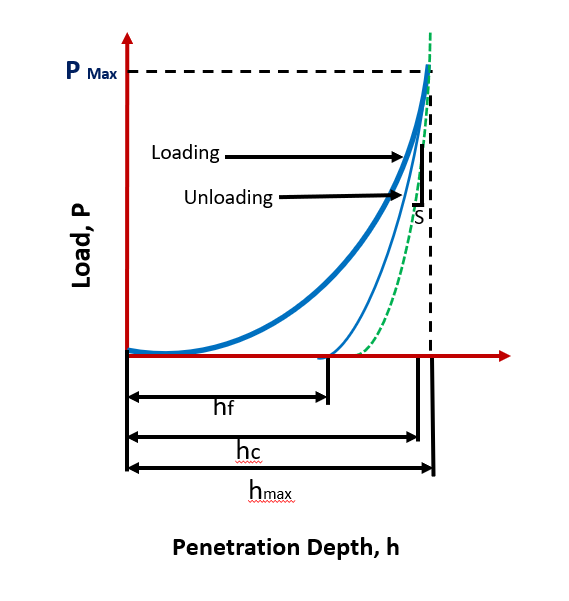
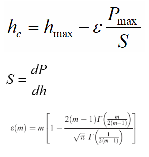
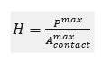
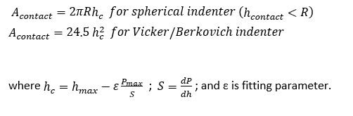
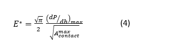
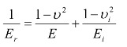

<b>Understanding the Load-Displacement Curve</b>  
Instrumented indentation uses a tip (which can come in three-sided Berkovich tip, or four sided Vickers tip, or conospherical or cube-corner or even as cylindrical punch) that is loaded at a predefined rate onto the material. The loading provides compression, and depending upon the tip geometry, a combined elasto-plastic regime is immediately observed by the material. As stress is typically very high (due to a very sharp tip), the transition from elastic to plastic regime is almost immediate in Berkovich and Vicker indenters. The loading curve shape (given by equation (1) during loading, and by equation (2) during unloading) is governed by the geometry of tip (and ensuing contact area of indenting tip with material), which is shown in Fig. 1, and is provided as.  
 
  
Fig. 1: A typical load-displacement curve, showing loading and unloading regime, during instrumented indentation of material.   
During loading,   

P=α1 hm	 		(1)  
Whereas, during unloading  
P=α2(h-hf )m		(2)  
where P is Applied Load, α and m are Fitting parameters (m=1 for flat cylinder, 2 for cones such as Berkovich and Vickers, and 1.5 for spheres), h is instantaneous displacement, hf is the final displacement after complete unloading, and hmax is the maximum displacement.  
As the deformation may directly enter the plastic regime, so utilizing the loading curve for estimation of elastic modulus (Young’s modulus) may not be correct. Therein, if the material has viscoelastic/viscoplastic nature (i.e. if stress and strain are not in phase), the duration of holding maximum load (i.e. dwell time) must be extended so the deformation comes to an equilibrium against an applied load. Now, after equilibration is set, then the release of load will make material relax purely under elastic regime, and that is when the measurement is made. It may be noted that the top 5-20% of unloading curve is only used as the plastic recovery of material may still occur in later part of the relaxation curve.  
Using the load-displacement curve, multiple material parameters (such as hardness and elastic modulus) can be extracted.   
<b>Estimation of Hardness:</b>  
In essence, hardness is defined as resistance to indentation, scratch and plastic deformation. The hardness (equation 3) of material is obtained as the ratio of applied load to that of contact area.   
  
where,  
  
Once the indenter geometry is known, the contact area (Acontact) can be evaluated from the indentation depth curve obtained during the instrumented indentation. Thus, the depth can become a direct measure of the contact area to provide resulting hardness at maximum applied load.  
<b>Estimation of Young’s Modulus:</b>  
Young’s modulus is defined as the slope of stress strain curve during the elastic portion (when the Hooke’s law is valid). In other words, Young’s modulus is fundamental property of material and governs the stiffness of the material. The elastic modulus (Young’s modulus) of the material can be evaluated using equation (4):  
  
(5)  
E and u are for sample and Ei and ui for indenter 
where ν is the Poisson’s ratio. As the material and the indenter tip are both in series and result the net deformation, thus the Young’s modulus of material (or sample) need to be extracted through equation (5).  
It may be noted that the elastic modulus is the stiffness of the associated atomic bonds, thus a high value can be expected for a perfect material. A high Young’s modulus can be obtained during instrumented nanoindentation due to size effects. Thus, continuous stiffness measurement may be obtained (i.e. elastic modulus change from surface to bulk, and the value below which stiffness does not change should be used for reporting the Young’s modulus when using instrumented indentation).

